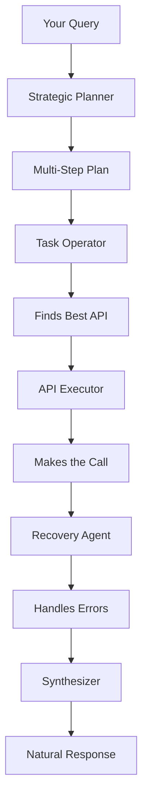

# AgentifyApi: Universal AI Agent for Any API

Transform any REST, gRPC, or GraphQL API into an AI-powered assistant. No coding required - just point to your API contracts and start asking questions in plain English.

---

## 🎯 What is AgentifyApi?

AgentifyApi is an intelligent middleware that:

- **Reads** your API contracts (OpenAPI/Swagger, .proto files, GraphQL schemas)
- **Understands** what each endpoint does using AI
- **Executes** complex multi-step operations autonomously
- **Recovers** from errors intelligently without human intervention

### Example in Action

You: "Find the user who made the most expensive order last month and check if they left any reviews"

AgentifyApi:

1. Searches for orders endpoint → Finds GET /orders
2. Filters orders by date → Executes with proper parameters
3. Finds user endpoint → GET /users/{id}
4. Finds reviews endpoint → GET /reviews?userId={id}
5. Returns: "User John Doe (ID: 123) made an order of $1,459. They left 3 reviews, all 5-star ratings."

## 🚀 Quick Start (5 minutes)

### Prerequisites
- Docker & Docker Compose
- OpenAI API key (for embeddings) [very easy to change provider]
- Google AI Studio API key (for Gemini) - [Get it free here](https://makersuite.google.com/app/apikey)

### Installation

1. **Clone and setup**
   ```bash
   git clone https://github.com/AndreaKant/AgentifyApi
   cd AgentifyApi
   cp .env.example .env
   ```

2. **Add your API keys to .env**
    ```env
   OPENAI_API_KEY="sk-..."
    GEMINI_API_KEY="AIza..."
   ```

4. **Start the system**
    ```bash
   docker-compose up -d
   ```

5. **Try it!**
    ```bash
   docker-compose exec agent python -m agent.main
   ```

## 🔧 Adding Your Own APIs

### Option 1: REST API (OpenAPI/Swagger)
1. Make sure your API has an OpenAPI spec endpoint (e.g., `/openapi.json`)
2. Add it to `indexer/main.py`:
   ```python
   rest_api_targets = [
       {"name": "Your API", "url": "http://your-api:8080/openapi.json"},
       # ... existing APIs
   ]
   ```

### Option 2: gRPC Service
1.  Copy your `.proto` file into the `contracts/` directory. The indexer will parse it automatically.
2.  Generate the Python stubs from your `.proto` file. You can run this command from the root of the project:
    ```bash
    python -m grpc_tools.protoc -I./contracts --python_out=./agent/tools --grpc_python_out=./agent/tools your_service.proto
    ```
3.  Import the new stubs and register the service in the `GRPC_REGISTRY` at the top of `agent/tools/executors.py`.

### Option 3: GraphQL
1.  Copy your `schema.graphql` file into the `contracts/` directory.
2.  The indexer will parse it automatically. The generic executor will handle it.

After adding new APIs, re-run the indexer:
```bash
    docker-compose up -d
```

## 🏗️ Architecture Overview


### Key Components:

- **Strategic Planner**: Uses Gemini Pro to break down complex requests
- **Task Operator**: Selects the right API for each step
- **Recovery Agent**: Implements ReAct pattern for error recovery
- **Vector Database**: Semantic search for finding relevant APIs

## 🐛 Troubleshooting

Almost all information are currently printed in console


## 🧪 Tests
[Coming soon]

## 🎥 Video Tutorial
[Coming soon]

## 📄 License
MIT License - see LICENSE file